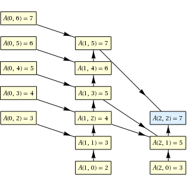
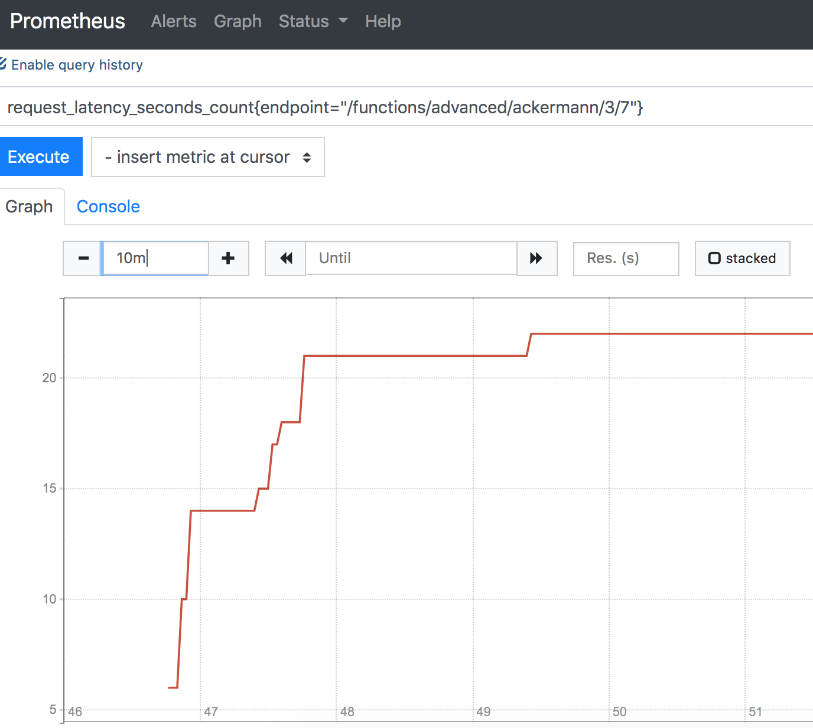

# Klarna Mathweb Stack

This assignment demonstrates a simple REST Api. The project is structured in the following way:

```
.                             # ROOT
├── Dockerfile                # The Docker build file for the Webserver
├── README.md                 # This file
├── data                      # Persistence data for redis and prometheus
│   ├── prometheus
│   └── redis
│       └── appendonly.aof    # Redis storage
├── docker-compose.yaml       # docker-compose file - configure variables here.
├── gunicorn_config.py        # gunicorn server configuration
├── klarnachallenge           # source directory
│   ├── __init__.py
│   ├── config.py
│   ├── errors.py
│   ├── functions.py
│   ├── middleware.py
│   └── server.py
├── prometheus.yaml           # Prometheus configuration
├── requirements.txt          # Python Requirements
├── run-development.py
├── test                      # unittest directory.
│   ├── __init__.py
│   ├── fibonacci.csv
│   ├── test_ackermann_as_a_service.py
│   ├── test_math.py
│   └── test_redis.py
...
```
For this project, I decided to use docker. The stack consists of three components, 
the Web Server to run the application code. Besides the Server, Redis is used for caching intermediate results.
For the metrics, Prometheus is used to collect metrics from the Web Server.
The Python 3 based Dockerfile uses an Alpine Linux base image and runs the Web Server - in this case GUnicorn.

## Run the docker stack

The following requirements are necessary to run this:

- docker
- internet connection

To run the stack go in the ROOT directory and call `docker-compose up`


## Endpoints

Now, to the functions. The API exposes all functions on the following endpoints:

```
http://localhost:5001/functions/simple/fibonacci/<signed_int:x>
http://localhost:5001/functions/simple/ackermann/<int:m>/<int:n>
http://localhost:5001/functions/simple/factorial/<signed_int:x>
http://localhost:5001/functions/advanced/ackermann/<int:m>/<int:n>
http://localhost:5001/functions/service/ackermann/<int:m>/<int:n>
```

There are 3 "simple" functions in place, and only 2 "advanced" ones - 2 of which are of type 'ackermann'. 
Let me explain why:
_Fibonacci Simple_ is using the _lru cache feature_, which makes it kinda _advanced_ already.

In my opinion, _Factorial Simple_ doesn't need an advanced version for this demo - It's fast enough already (for the demo).

Which leaves us with the option to try different approaches for the hardest optimization problem: the _Ackermann_ function.
The _Simple Ackermann_ is trying to mitigate the problem by using the lru cache, which improves runtime significant. 
But this cache is non-persistent and theoretically limited by memory. I decided to focus on 2 different approaches to 
optimize this function:

## The _Cached Ackermann_

Storing intermediate results of the Ackermann function in a redis hash and retrieving it once needed.
The Idea is that the more Ackermann functions we calculated, the less we need to calculate in the future.
Explanation: An Ackermann function call can look like this:



A lot of calculations are required to get the final result. Let's assume, we calculated Ackermann(2, 2) before. 
A(0,6), A(0,5), A(0,3), A(1, 5) .... are stored in redis and would not require further incremental calculation. 
This storing of the sub-results decrease the required calculations for other Ackermann function. 
For instance, Ackermann(2,1) would not require any calculation and could be looked up from cache directly.


## The _Ackermann as a Service_

This approach is more for fun and is using the WolframAlpha computation service. A simple web request gives us the 
correct result without wasing any of _our own_ computation power. It is not very practical and also slower, 
but if the requirement is "low energy and less cpu", this approach might be a good alternative.


## Bonus - Logging

As mentioned above, Prometheus is collecting some metrics from the Webserver.
There can be a lot of interesting metrics to monitor. It would be nice to monitor the cache utilization and memory usage 
of the algorithms. But the most interesting metric is the request latency for each endpoint. 
The _middleware_ implements this function and exposes the results on a dedicated `/metics` Endpoint to Prometheus.

> Note: For this demo, there is no authentication in place on this endpoint - 
everyone could scrape the metrics from our API - not good. But for demo purposes, 
i'll keep it simple. Just mentioning... 





> Prometheus is running on http://localhost:9090

Of course, Grafana could be added to visualize data in a nice way, but out of scope for this challenge.


## Known problems and improvments

The solution is not perfect. Ackermann calculations itself grow very (!!) fast in size and the halting problem is still
a thing in computer science ;-). Our server crashes after X recursion and gives up.

Metrics can and should be extended and improved in a real system. I hope you have as much fun playing around with
this demo as I had building it.


Greetings and happy testing!
Christoph